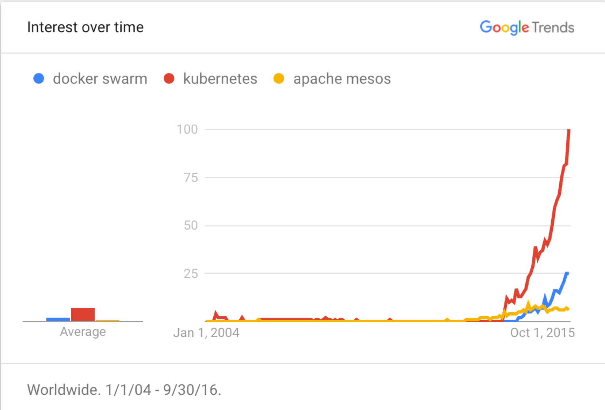

# **第7章：Google出品的PaaS框架—Kubernetes**

## Overview of Kubernetes

- Kubernetes is one of the top projects on GitHub: in the top 0.01 percent in stars and No. 1 in terms of activity.
- While documentation is subpar, Kubernetes has a significant Slack and Stack Overflow community that steps in to answer questions and foster collaboration, with growth that dwarfs that of its rivals.
- More professionals [list Kubernetes in their LinkedIn profile](https://www.linkedin.com/vsearch/p?keywords=Kubernetes&openAdvancedForm=true&locationType=Y&rsid=52201473175930629&orig=ADVS) than any other comparable offering by a wide margin.
- Perhaps most glaring, data from OpenHub shows Apache Mesos dwindling since its initial release and Docker Swarm starting to slow. In terms of raw community contributions, Kubernetes is exploding, with 1,000-plus contributors and 34,000 commits -- more than four times those of nearest rival Mesos.

According to the Kubernetes [website](http://kubernetes.io/) – “**Kubernetes is an open-source system for automating deployment, scaling, and management of containerized applications**.” Kubernetes was built by Google based on their experience running containers in production over the last decade. See below for a Kubernetes architecture diagram and the following explanation.

Kubernetes offers cluster management that is well-adapted to working on today’s technology stacks. Whether running CoreOS, RedHat or any of the multitude of OS’s available, Kubernetes can spin up clusters in seconds. As an open source project created by Google Cloud Platform, Kubernetes continues to be developed and shaped by the community that relies on it for daily workflow management when working with cluster-based projects. Kubernetes is written in [Go](https://golang.org/), which makes it fast, lightweight and more responsive than languages such as Python.

Between pods, labels and services, Kubernetes offers a robust way to interact with clusters:

- **Pods** are small groups of Docker containers, able to be maintained within Kubernetes. Pods are easily deployable, resulting in less downtime when testing a build or QA debugging.Pods are the rough equivalent of a machine instance (physical or virtual) to a container. Each pod is allocated its own internal IP address, therefore owning its entire port space, and containers within pods can share their local storage and networking.

  Pods have a lifecycle; they are defined, then they are assigned to run on a node, then they run until their container(s) exit or they are removed for some other reason. Pods, depending on policy and exit code, may be removed after exiting, or may be retained in order to enable access to the logs of their containers.

- **Labels** are exactly as they sound, used to organize groups of objects determined by their key:value pairs.For example, [pods](https://docs.openshift.org/latest/architecture/core_concepts/pods_and_services.html#pods) are "tagged" with labels, and then [services](https://docs.openshift.org/latest/architecture/core_concepts/pods_and_services.html#services) use label selectors to identify the pods they proxy to. This makes it possible for services to reference groups of pods, even treating pods with potentially different Docker containers as related entities.

  Most objects can include labels in their metadata. So labels can be used to group arbitrarily-related objects; for example, all of the [pods](https://docs.openshift.org/latest/architecture/core_concepts/pods_and_services.html#pods), [services](https://docs.openshift.org/latest/architecture/core_concepts/pods_and_services.html#services), [replication controllers](https://docs.openshift.org/latest/architecture/core_concepts/deployments.html#replication-controllers), and [deployment configurations](https://docs.openshift.org/latest/architecture/core_concepts/deployments.html#deployments-and-deployment-configurations) of a particular application can be grouped.

- **Services** are used for load balancing, providing a centralized name and address for a set of pods.Services are assigned an IP address and port pair that, when accessed, proxy to an appropriate backing pod. A service uses a label selector to find all the containers running that provide a certain network service on a certain port.

  Kubernetes has two different implementations of the service-routing infrastructure. The default implementation is entirely**iptables**-based, and uses probabilistic **iptables** rewriting rules to distribute incoming service connections between the endpoint pods. The older implementation uses a user space process to accept incoming connections and then proxy traffic between the client and one of the endpoint pods.

  The **iptables**-based implementation is much more efficient, but it requires that all endpoints are always able to accept connections; the user space implementation is slower, but can try multiple endpoints in turn until it finds one that works. If you have good [readiness checks](https://docs.openshift.org/latest/dev_guide/application_health.html#dev-guide-application-health) (or generally reliable nodes and pods), then the **iptables**-based service proxy is the best choice. Otherwise, you can enable the user space-based proxy [when installing](https://docs.openshift.org/latest/install_config/install/advanced_install.html#install-config-install-advanced-install), or after deploying the cluster by editing the [node configuration file](https://docs.openshift.org/latest/install_config/master_node_configuration.html#install-config-master-node-configuration).

- **Clusters** on Kubernetes eliminates the need for developers to worry about physical machines, acting as lightweight VMs in their own right, each capable of handling tasks which require scalability.

- **Api server** validates and configures data for the api objects which include pods, services, replicationcontrollers, and others. The API Server services REST operations and provides the frontend to the cluster’s shared state through which all other components interact.

- **Controller manager**  is a daemon that embeds the core control loops shipped with Kubernetes. In applications of robotics and automation, a control loop is a non-terminating loop that regulates the state of the system. In Kubernetes, a controller is a control loop that watches the shared state of the cluster through the apiserver and makes changes attempting to move the current state towards the desired state. Examples of controllers that ship with Kubernetes today are the replication controller, endpoints controller, namespace controller, and serviceaccounts controller.

- **kubelet**  is the primary “node agent” that runs on each node. The kubelet works in terms of a PodSpec. A PodSpec is a YAML or JSON object that describes a pod. The kubelet takes a set of PodSpecs that are provided through various mechanisms (primarily through the apiserver) and ensures that the containers described in those PodSpecs are running and healthy. The kubelet doesn’t manage containers which were not created by Kubernetes.

  Other than from an PodSpec from the apiserver, there are three ways that a container manifest can be provided to the Kubelet.

  File: Path passed as a flag on the command line. This file is rechecked every 20 seconds (configurable with a flag).

  HTTP endpoint: HTTP endpoint passed as a parameter on the command line. This endpoint is checked every 20 seconds (also configurable with a flag).

  HTTP server: The kubelet can also listen for HTTP and respond to a simple API (underspec’d currently) to submit a new manifest.

- **Scheduler** is responsible for determining placement of new pods onto nodes within the cluster. It reads data from the pod and tries to find a node that is a good fit based on configured policies. It is completely independent and exists as a standalone/pluggable solution. It does not modify the pod and just creates a binding for the pod that ties the pod to the particular node.

  The existing generic scheduler is the default platform-provided scheduler "engine" that selects a node to host the pod in a 3-step operation:

  1. Filter the nodes
  2. Prioritize the filtered list of nodes
  3. Select the best fit node

At a minimum, Kubernetes can schedule and run application containers on clusters of physical or virtual machines. However, Kubernetes also allows developers to ‘cut the cord’ to physical and virtual machines, moving from a **host-centric** infrastructure to a **container-centric** infrastructure, which provides the full advantages and benefits inherent to containers. Kubernetes provides the infrastructure to build a truly **container-centric** development environment.

Kubernetes satisfies a number of common needs of applications running in production, such as:

- [co-locating helper processes](http://kubernetes.io/docs/user-guide/pods/), facilitating composite applications and preserving the one-application-per-container model,
- [mounting storage systems](http://kubernetes.io/docs/user-guide/volumes/),
- [distributing secrets](http://kubernetes.io/docs/user-guide/secrets/),
- [application health checking](http://kubernetes.io/docs/user-guide/production-pods/#liveness-and-readiness-probes-aka-health-checks),
- [replicating application instances](http://kubernetes.io/docs/user-guide/replication-controller/),
- [horizontal auto-scaling](http://kubernetes.io/docs/user-guide/horizontal-pod-autoscaling/),
- [naming and discovery](http://kubernetes.io/docs/user-guide/connecting-applications/),
- [load balancing](http://kubernetes.io/docs/user-guide/services/),
- [rolling updates](http://kubernetes.io/docs/user-guide/update-demo/),
- [resource monitoring](http://kubernetes.io/docs/user-guide/monitoring/),
- [log access and ingestion](http://kubernetes.io/docs/user-guide/logging/),
- [support for introspection and debugging](http://kubernetes.io/docs/user-guide/introspection-and-debugging/), and
- [identity and authorization](http://kubernetes.io/docs/admin/authorization/).

This provides the simplicity of Platform as a Service (PaaS) with the flexibility of Infrastructure as a Service (IaaS), and facilitates portability across infrastructure providers.

#### Why and how is Kubernetes a platform?

Even though Kubernetes provides a lot of functionality, there are always new scenarios that would benefit from new features. Application-specific workflows can be streamlined to accelerate developer velocity. Ad hoc orchestration that is acceptable initially often requires robust automation at scale. This is why Kubernetes was also designed to serve as a platform for building an ecosystem of components and tools to make it easier to deploy, scale, and manage applications.

[Labels](http://kubernetes.io/docs/user-guide/labels/) empower users to organize their resources however they please. [Annotations](http://kubernetes.io/docs/user-guide/annotations/) enable users to decorate resources with custom information to facilitate their workflows and provide an easy way for management tools to checkpoint state.

Additionally, the [Kubernetes control plane](http://kubernetes.io/docs/admin/cluster-components) is built upon the same [APIs](http://kubernetes.io/docs/api/) that are available to developers and users. Users can write their own controllers, [schedulers](https://github.com/kubernetes/kubernetes/tree/master/docs/devel/scheduler.md), etc., if they choose, with [their own APIs](https://github.com/kubernetes/kubernetes/blob/master/docs/design/extending-api.md) that can be targeted by a general-purpose [command-line tool](http://kubernetes.io/docs/user-guide/kubectl-overview/).

This [design](https://github.com/kubernetes/kubernetes/blob/master/docs/design/principles.md) has enabled a number of other systems to build atop Kubernetes.

#### Kubernetes is not:

Kubernetes is not a traditional, all-inclusive PaaS (Platform as a Service) system. We preserve user choice where it is important.

- Kubernetes does not limit the types of applications supported. It does not dictate application frameworks (e.g., [Wildfly](http://wildfly.org/)), restrict the set of supported language runtimes (e.g., Java, Python, Ruby), cater to only [12-factor applications](http://12factor.net/), nor distinguish “apps” from “services”. Kubernetes aims to support an extremely diverse variety of workloads, including stateless, stateful, and data-processing workloads. If an application can run in a container, it should run great on Kubernetes.
- Kubernetes does not provide middleware (e.g., message buses), data-processing frameworks (e.g., Spark), databases (e.g., mysql), nor cluster storage systems (e.g., Ceph) as built-in services. Such applications run on Kubernetes.
- Kubernetes does not have a click-to-deploy service marketplace.
- Kubernetes is unopinionated in the source-to-image space. It does not deploy source code and does not build your application. Continuous Integration (CI) workflow is an area where different users and projects have their own requirements and preferences, so we support layering CI workflows on Kubernetes but don’t dictate how it should work.
- Kubernetes allows users to choose the logging, monitoring, and alerting systems of their choice. (Though we do provide some integrations as proof of concept.)
- Kubernetes does not provide nor mandate a comprehensive application configuration language/system (e.g., [jsonnet](https://github.com/google/jsonnet)).
- Kubernetes does not provide nor adopt any comprehensive machine configuration, maintenance, management, or self-healing systems.

On the other hand, a number of PaaS systems run *on* Kubernetes, such as [Openshift](https://github.com/openshift/origin), [Deis](http://deis.io/), and [Gondor](https://gondor.io/). You could also roll your own custom PaaS, integrate with a CI system of your choice, or get along just fine with just Kubernetes: bring your container images and deploy them on Kubernetes.

Since Kubernetes operates at the application level rather than at just the hardware level, it provides some generally applicable features common to PaaS offerings, such as deployment, scaling, load balancing, logging, monitoring, etc. However, Kubernetes is not monolithic, and these default solutions are optional and pluggable.

Additionally, Kubernetes is not a mere “orchestration system”; it eliminates the need for orchestration. The technical definition of “orchestration” is execution of a defined workflow: do A, then B, then C. In contrast, Kubernetes is comprised of a set of independent, composable control processes that continuously drive current state towards the provided desired state. It shouldn’t matter how you get from A to C: make it so. Centralized control is also not required; the approach is more akin to “choreography”. This results in a system that is easier to use and more powerful, robust, resilient, and extensible.

## Resouce management in Kubernetes

- **Replica controller**
- **DaemonSet**
- **PetSet**
- **Job**
- **Quota and request/limit**

## Networking in Kubernetes

Kubernetes approaches networking somewhat differently than Docker does by default. There are 4 distinct networking problems to solve:

1. Highly-coupled container-to-container communications: this is solved by [pods](http://kubernetes.io/docs/user-guide/pods/) and `localhost` communications.
2. Pod-to-Pod communications: this is the primary focus of this document.
3. Pod-to-Service communications: this is covered by [services](http://kubernetes.io/docs/user-guide/services/).
4. External-to-Service communications: this is covered by [services](http://kubernetes.io/docs/user-guide/services/).

### Docker model

Before discussing the Kubernetes approach to networking, it is worthwhile to review the “normal” way that networking works with Docker. By default, Docker uses host-private networking. It creates a virtual bridge, called `docker0` by default, and allocates a subnet from one of the private address blocks defined in [RFC1918](https://tools.ietf.org/html/rfc1918) for that bridge. For each container that Docker creates, it allocates a virtual ethernet device (called `veth`) which is attached to the bridge. The veth is mapped to appear as `eth0` in the container, using Linux namespaces. The in-container `eth0` interface is given an IP address from the bridge’s address range.

The result is that Docker containers can talk to other containers only if they are on the same machine (and thus the same virtual bridge). Containers on different machines can not reach each other - in fact they may end up with the exact same network ranges and IP addresses.

In order for Docker containers to communicate across nodes, they must be allocated ports on the machine’s own IP address, which are then forwarded or proxied to the containers. This obviously means that containers must either coordinate which ports they use very carefully or else be allocated ports dynamically.

### Kubernetes model

Coordinating ports across multiple developers is very difficult to do at scale and exposes users to cluster-level issues outside of their control. Dynamic port allocation brings a lot of complications to the system - every application has to take ports as flags, the API servers have to know how to insert dynamic port numbers into configuration blocks, services have to know how to find each other, etc. Rather than deal with this, Kubernetes takes a different approach.

Kubernetes imposes the following fundamental requirements on any networking implementation (barring any intentional network segmentation policies):

- all containers can communicate with all other containers without NAT
- all nodes can communicate with all containers (and vice-versa) without NAT
- the IP that a container sees itself as is the same IP that others see it as

What this means in practice is that you can not just take two computers running Docker and expect Kubernetes to work. You must ensure that the fundamental requirements are met.

This model is not only less complex overall, but it is principally compatible with the desire for Kubernetes to enable low-friction porting of apps from VMs to containers. If your job previously ran in a VM, your VM had an IP and could talk to other VMs in your project. This is the same basic model.

Until now this document has talked about containers. In reality, Kubernetes applies IP addresses at the `Pod` scope - containers within a `Pod` share their network namespaces - including their IP address. This means that containers within a `Pod` can all reach each other’s ports on `localhost`. This does imply that containers within a `Pod` must coordinate port usage, but this is no different than processes in a VM. We call this the “IP-per-pod” model. This is implemented in Docker as a “pod container” which holds the network namespace open while “app containers” (the things the user specified) join that namespace with Docker’s `--net=container:` function.

As with Docker, it is possible to request host ports, but this is reduced to a very niche operation. In this case a port will be allocated on the host `Node` and traffic will be forwarded to the `Pod`. The `Pod` itself is blind to the existence or non-existence of host ports.

## Storage Provisioning and Allocation in Kubernetes
One of the key challenges in running containerized workloads is dealing with persistence. Unlike virtual machines that offer durable and persistent storage, containers come with ephemeral storage. Right from its inception, [Docker](http://thenewstack.io/tag/Docker/)encouraged the design of stateless services. Persistence and statefulness are an afterthought in the world of containers. But this design works in favor of workload scalability and portability. It is one of the reasons why containers are fueling cloud-native architectures, microservices, and web-scale deployments.

Having realized the benefits of containers, there is an ongoing effort to containerize stateful applications that can be seamlessly run with stateless application. Docker volumes and plugins [are a major step](http://thenewstack.io/methods-dealing-container-storage/) towards turning stateful applications into first-class citizens of Docker. 

Kubernetes abstracts the underlying infrastructure building blocks into compute, storage and networking. When developers and operations teams get started with Kubernetes, they typically get exposed to objects such as pods, labels, services, deployments and replica sets, which provide a mechanism to deal with compute and networking. When it comes to persistence in Kubernetes, users should get familiar with the concepts of volumes, persistent volumes, persistent volume claims (PVC) and the upcoming Pet Sets.

To appreciate how [Kubernetes](http://www.thenewstack.io/tag/Kubernetes) manages storage pools that provide persistence to applications, we need to understand the architecture and the workflow related to application deployment.

Kubernetes is used in various roles — by developers, system administrators, operations, and DevOps teams. Each of these personas, if you will, interact with the infrastructure in a distinct way. The system administration team is responsible for configuring the physical infrastructure for running Kubernetes cluster. The operations team maintains the Kubernetes cluster through patching, upgrading, and scaling the cluster. DevOps teams deal with Kubernetes to configure CI/CD, monitoring, logging, rolling upgrades, and canary deployments. Developers consume the API and the resources exposed by the Kubernetes infrastructure. They are never expected to have visibility into the underlying physical infrastructure that runs the master and nodes.

Developers “ask” for the resources they need to run their applications through a declarative mechanism, typically described in [YAML](http://yaml.org/) or [JSON](http://www.json.org/). The Kubernetes master is responsible for ensuring that the appropriate resources are selected as requested by the developers. But before it can do that, the administrators will need to provision the required compute, storage, and networking capacity.

For example, a developer may ask Kubernetes to schedule a pod backed by SSD running powered by a certain number of cores and memory. Assuming that the infrastructure is capable, Kubernetes master honors the request by choosing the right node(s) to run the pod.

To understand this concept, let’s look at the relationship between a pod and node. Nodes are pre-provisioned servers configured by administrators and operations team. Developers create pods that utilize the compute resources exposed by the nodes.

This architecture of Kubernetes enables clean separation of concerns among developers, administrators, and operations.

### Volumes

[Kubernetes volumes](http://kubernetes.io/docs/user-guide/volumes/) are similar to [Docker volumes](https://docs.docker.com/userguide/dockervolumes/). Both are designed to bring a level of persistence to containers by relying on the underlying host.Kubernetes has a slightly different storage requirements than Docker. Since it supports packaging multiple containers into a pod, which is a logical unit of deployment, all the containers belonging to a specific pod should share the data. Containers in a pod may be occasionally restarted, which shouldn’t impact the storage mechanism. Unlike Docker volumes that are influenced by a specific container, Kubernetes volumes are tied to the lifecycle of a pod. Even if the containers running within a pod get terminated or restarted, the associated volume will continue to exist. It will only get deleted when the pod is explicitly terminated.

In scenarios where a volume should be made available even after terminating a pod, it may be based on a durable block storage backend, such as Amazon EBS, Google Compute Engine’s Persistent Disks (GCE PD), or a distributed file system such as network file system (NFS) or Gluster. The key takeaway is that multiple containers packaged as a pod share the same volume.

Kubernetes volumes may be classified into host-based storage and non-host-based storage types. Host-based storage is similar to Docker volumes, where a portion of the host’s storage becomes available to the pod. Once a pod is terminated, the volume gets automatically deleted. Non-host-based storage doesn’t rely on a specific node. Instead, a storage volume is created from an external storage service. Volumes based on this storage type would be available even after the pods are deleted.

A variety of block storages, distributed filesystems and hosted filesystems — including Amazon EBS, GCE PD, Ceph, Gluster, NFS, Azure File System, Flocker and vSphere volumes — are supported. 

Volumes are ideal for use cases where containers are migrated from a Docker to a Kubernetes environment. Given its compatibility with Docker volumes, applications designed for host-based persistence can easily take advantage of the feature.

### persistent volumes and claims

In the [last part of this series](http://thenewstack.io/strategies-running-stateful-applications-kubernetes-volumes/), we explored how the concept of volumes brings persistence to containers. Let's introduce persistent volumes and claims, which form the robust storage infrastructure of Kubernetes.

Let’s now expand the analogy of a pod and node to storage. Before developers can start using the storage, administrators need to provision persistent volumes. Unlike volumes, persistent volumes are not associated with any specific pod or containers when they are created. They are pre-provisioned storage resources that can be used by developers during the creation of a pod. Once persistence volumes (PersistentVolume) are provisioned by administrators, developers create a claim (PersistentVolumeClaim) to start consuming the storage resources exposed as persistent volumes.

This is very similar to the relationship between the node and pods. Before deploying pods, developers assume that the nodes are provisioned and available. Similarly, before creating a claim, developers assume the availability of persistent volumes. Claims and persistent volumes are to storage what pods and nodes are to compute.

Source: Steve Watt, Red Hat

It’s also important to understand the difference between Kubernetes volumes and persistent volumes. Volumes are similar to Docker volumes in which containers request for persistence at runtime, which is provided by the host. Volumes can use implicit host-based storage or can explicitly request for persistence backed by external block storage devices and distributed file systems. But the developer doesn’t expect a storage resource to be pre-provisioned before using volumes. In persistent volumes and claims, there is a strict enforcement of resource utilization dictated by the policy defined during the creation of resources.

Traditional Kubernetes volumes can take advantage of persistent volumes. Pods can access storage by using the claim as a volume. Claims must exist in the same namespace as the pod using the claim. The volume is then mounted to the host and into the pod.

#### Terminology, Concepts, and Lifecycle

**PersistentVolume** (PV) is of networked storage resource of the cluster that has been provisioned by an administrator. It is a resource in the cluster just like a node is a cluster resource.

PVs are volume plugins like Volumes, but they have a distinct lifecycle that is independent of any individual pod that consumes the PV.

A **PersistentVolumeClaim** (PVC) is a request for storage by a developer. It is similar to a pod. Pods consume node resources and PVCs consume PV resources. Pods can request specific levels of resources (CPU and Memory). Claims can request specific storage size and access modes such as read and read-write.

PVCs and PVs can be matched through the concept of labels and selectors. During the creation of a PV, administrators can create labels with attributes. PVCs can use selectors to ensure that they are always bound to the matching PVs with matching labels.

PersistentVolume types are implemented as plugins. Kubernetes supports popular backends and distributed file systems including Amazon EBS, GCE Persistent Disks, Cinder, Azure File System, NFS, iSCSI, Gluster, and Ceph among other types.

A StorageClass enables administrators to create multiple tiers or classes of storage they offer. Different classes map to different levels of quality-of-service, backup policies, and arbitrary policies as defined by the administrators.

There are five phases in the life cycle of a persistent volume:

1. Provisioning
2. Binding
3. Using
4. Releasing
5. Reclaiming

During the provisioning phase, an administrator creates a PV from an existing physical storage pool. Provisioning supports static and dynamic modes. When a developer requests a claim, Kubernetes looks for an existing PV that matches the requirement. This is called static provisioning. When none of the static PVs the administrator created matches a developer’s claim, the cluster may try to dynamically provision a volume for that PVC. This mode of provisioning is dynamically handled by Kubernetes, provided that the physical resources are available.

Binding is a phase where the claim gets bound to a specific persistent volume. By analyzing the PVC, Kubernetes will find a matching PV, and associates both of them.

After the PVC is bound to a PV, pods will start using claims as volumes. This is when the developer defines the mode (read or write) for accessing the volume.

When an application is done with using the volume, developers can delete the PVC objects through the API, releasing the claim. This step will initiate the reclamation process. But until the claim is deleted, the volume would not be freed up for others to use.

The last phase is reclamation, which is defined as a policy by the administrators. The reclaim policy for a PersistentVolume tells the cluster what to do with the volume after it has been released of its claim. Persistent volumes can either be retained, recycled or deleted. Depending on the storage backend, an appropriate action can be taken on the persistent volume. In case of using block storage, they may deleted by invoking the cloud-specific API. In scenarios where a volume was created from distributed storage, a simple scrub command may be issued.

